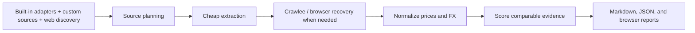

<div align="center">


<br />

**Production-oriented, painting price research bot**<br/>

[](https://nodejs.org/)
[](https://pnpm.io/)
[](https://www.npmjs.com/package/artbot)
[](https://www.npmjs.com/package/artbot)
[](https://github.com/KhazP/artbot/actions/workflows/ci.yml)
[](https://github.com/KhazP/artbot)
[](LICENSE)
[](#-docker)

</div>

---

## ✨ Key Characteristics

| Area                     | Details                                                                                                                                   |
| ------------------------ | ----------------------------------------------------------------------------------------------------------------------------------------- |
| **Runtime**              | Local-first — SQLite (`node:sqlite`) + filesystem evidence                                                                                |
| **Access Statuses**      | `public_access` · `auth_required` · `licensed_access` · `blocked` · `price_hidden`                                                        |
| **Session Handling**     | Authorized profiles, cookie injection, persistent browser state, manual-login checkpoints; expired/missing sessions refresh automatically |
| **Turkey-First Sources** | `muzayedeapp-platform` · `portakal-catalog` · `clar-buy-now` · `clar-archive` · `sanatfiyat-licensed-extractor`                           |
| **Discovery**            | Bounded query variants, listing-to-lot routing, comprehensive hybrid web discovery with strict host/domain caps                           |
| **FX Normalization**     | Nominal USD + CPI-adjusted 2026 USD outputs                                                                                               |
| **Evidence**             | Screenshot + raw snapshot + parser metadata for every accepted/rejected candidate                                                         |

### Architecture Pipeline



The normal path is deterministic and local: seed source adapters, expand query variants, add web-discovered candidates when enabled, extract with the cheapest lawful transport first, then escalate to Crawlee or Playwright only for JS-heavy pages, login/session flows, or low-confidence recovery.

---

## Install

### npm

```bash
npm install -g artbot
artbot backend start
artbot backend status
artbot research artist --artist "Burhan Dogancay" --preview-only
artbot research artist --artist "Burhan Dogancay" --wait
```

The npm package includes the CLI plus bundled local API and worker runtime. No hosted ArtBot service is required. Runtime state lives under `~/.artbot` by default: `.env`, SQLite DB, run artifacts, logs, and Playwright auth state.

`npx artbot@latest --help` is fine for a one-off check, but a global install is the intended shell workflow.

### From This Repo

```bash
pnpm install
cp .env.example .env
pnpm build
pnpm run start:artbot
pnpm --filter artbot dev -- --json doctor
```

Repo-local commands should use:

```bash
pnpm --filter artbot dev -- <command>
```

Global npm commands use:

```bash
artbot <command>
```

---

## CLI Commands

Bare `artbot` opens the interactive TUI only in an interactive terminal. Automation should use explicit subcommands and `--json` or `--output-format stream-json`.

```bash
# Health and local backend
artbot doctor
artbot backend start
artbot backend status
artbot backend stop

# Research
artbot research artist --artist "Fikret Mualla" --preview-only
artbot research artist --artist "Fikret Mualla" --wait
artbot research work --artist "Bedri Rahmi Eyuboglu" --title "Mosaic" --wait

# Run inspection
artbot runs list --limit 20
artbot runs show --run-id <id>
artbot runs watch --run-id <id> --interval 2
artbot runs deep-research --run-id <id>
artbot runs deep-research --run-id <id> --web

# Retention and cleanup
artbot runs pin --run-id <id>
artbot runs unpin --run-id <id>
artbot storage
artbot cleanup --dry-run
artbot cleanup --max-size-gb 4 --keep-last 50

# Debug/review
artbot replay attempt --run-id <id>
artbot review queue --run-id <id>
artbot review decide --run-id <id> --item-id <item-id> --decision merge
artbot graph explain --run-id <id> --cluster-id <cluster-id>
artbot canaries run
artbot canaries history
```

Global options:

| Option                 | Purpose                               |
| ---------------------- | ------------------------------------- |
| `--json`               | Strict JSON response on stdout        |
| `--output-format json` | Same JSON mode as `--json`            |
| `--output-format stream-json` | Newline-delimited lifecycle events |
| `--api-base-url <url>` | Override API endpoint                 |
| `--api-key <key>`      | API key override                      |
| `--verbose`            | Extra diagnostics                     |
| `--quiet`              | Suppress non-essential text output    |
| `--no-tui`             | Disable interactive UI launch         |

Set `ARTBOT_NO_TUI=1` when wrapping the CLI in automation that must never open an interactive prompt.

---

## Custom Source Websites

ArtBot includes built-in source adapters and can also discover open-web candidates during comprehensive runs. For operator-controlled coverage, add local custom sources to `artbot.sources.json`.

Resolution order:

1. `ARTBOT_SOURCES_PATH`
2. `ARTBOT_HOME/artbot.sources.json`
3. `INIT_CWD/artbot.sources.json`
4. `./artbot.sources.json`

CLI management:

```bash
artbot sources list --json
artbot sources validate
artbot sources add \
  --name "Example Auction Archive" \
  --url "https://example.com" \
  --search-template "https://example.com/search?q={query}" \
  --access public \
  --source-class auction_house
artbot sources remove --id example-auction-archive
```

Supported access modes:

| Mode       | Behavior |
| ---------- | -------- |
| `public`   | Uses anonymous public access first, with browser recovery only when needed |
| `auth`     | Keeps the source visible as `auth_required` until a matching auth profile/session exists |
| `licensed` | Requires `--allow-licensed` and a matching `--licensed-integrations` entry |

Example file:

```json
{
  "version": 1,
  "sources": [
    {
      "id": "example-auction-archive",
      "name": "Example Auction Archive",
      "url": "https://example.com",
      "searchTemplate": "https://example.com/search?q={query}",
      "access": "public",
      "sourceClass": "auction_house",
      "sourcePageType": "listing",
      "country": "Turkey",
      "crawlHints": ["auction result", "artist"]
    },
    {
      "id": "member-price-db",
      "name": "Member Price DB",
      "url": "https://member.example",
      "searchTemplate": "https://member.example/search?q={query}",
      "access": "auth",
      "sourceClass": "database",
      "authProfileId": "member-db"
    }
  ]
}
```

Custom sources use the generic extraction path first. Promote important sources to dedicated adapters when they need source-specific parsing, fixtures, or canaries.

---

## Auth and Licensed Access

Credentials do not belong in `artbot.sources.json`. Use `AUTH_PROFILES_JSON` and Playwright storage-state capture.

```json
[
  {
    "id": "member-db",
    "mode": "authorized",
    "sourcePatterns": ["member.example"],
    "storageStatePath": "/secure/path/member-db-state.json",
    "sessionTtlMinutes": 360
  },
  {
    "id": "sanatfiyat-license",
    "mode": "licensed",
    "sourcePatterns": ["sanatfiyat"],
    "storageStatePath": "/secure/path/sanatfiyat-state.json",
    "sensitivity": "licensed"
  }
]
```

Capture or refresh a login session:

```bash
artbot trust allow
artbot auth list
artbot auth status
artbot auth capture member-db --url https://member.example/login
```

Research flags:

| Flag | Purpose |
| ---- | ------- |
| `--auth-profile <id>` | Force a named auth profile for the run |
| `--cookie-file <path>` | Inject a cookie JSON file |
| `--manual-login` | Capture pre/post manual-login checkpoints |
| `--allow-licensed` | Allow licensed integrations for this run |
| `--licensed-integrations "Sanatfiyat,askART"` | Explicit licensed source allowlist |
| `--analysis-mode comprehensive\|balanced\|fast` | Run depth and candidate caps |
| `--price-normalization legacy\|usd_dual\|usd_nominal\|usd_2026` | Price output format |

Interactive setup, TUI launch, auth capture, and backend start/stop require workspace trust:

```bash
artbot trust status
artbot trust allow
artbot trust deny
```

---

## Discovery and Source Coverage

Built-in baseline sources include Turkey-first auction/platform adapters, global auction houses, global marketplaces, and optional probe/licensed sources. The current source matrix is tracked in [docs/source-matrix.md](docs/source-matrix.md).

Discovery layers:

- Built-in source adapters and source-specific candidate generation.
- Local query variants and listing-to-lot expansion.
- Optional web discovery through SearXNG, Brave, Tavily, and DuckDuckGo HTML fallback.
- Dynamic host-fingerprint adapters for discovered hosts.
- Local custom sources from `artbot.sources.json`.

Useful environment variables:

| Variable | Purpose |
| -------- | ------- |
| `WEB_DISCOVERY_ENABLED` | Enable web discovery where the selected analysis mode allows it |
| `WEB_DISCOVERY_PROVIDER` | `none`, `searxng`, `brave`, or `tavily` |
| `WEB_DISCOVERY_SECONDARY_PROVIDER` | Optional failover provider |
| `SEARXNG_BASE_URL` | Local SearXNG endpoint, default `http://127.0.0.1:8080` |
| `BRAVE_SEARCH_API_KEY` / `TAVILY_API_KEY` | Optional paid provider keys |
| `FIRECRAWL_ENABLED` | Optional public-page cheap-fetch path, disabled by default |
| `FIRECRAWL_BASE_URL` | Self-hosted Firecrawl endpoint |
| `FIRECRAWL_SOURCE_FAMILIES` | Firecrawl allowlist by source family |

Firecrawl is not used for authenticated/sessioned browsing. Login/session flows belong to Playwright browser capture.

---

## Output Artifacts

Each run writes local artifacts under the configured runs root:

```text
var/runs/<run_id>/
├── results.json
├── report.md
├── deep-research.json       # only when experimental deep research is enabled
├── artifact-manifest.json
└── evidence/
    ├── screenshots/
    ├── raw/
    ├── traces/
    └── har/
```

Attempts include source URL, canonical URL, access mode/status, extraction fields, parser/model metadata, confidence, acceptance/rejection reasons, and retained evidence paths. Auth/browser flows may include pre-auth and post-auth screenshot paths.

---

## Models and Deep Research

Core extraction can run with local or OpenAI-compatible model endpoints.

| Variable | Purpose |
| -------- | ------- |
| `STRUCTURED_LLM_PROVIDER` | `auto`, `gemini`, or `openai_compatible` |
| `LLM_BASE_URL` | OpenAI-compatible endpoint, for example LM Studio or NVIDIA |
| `LLM_API_KEY` | API key; local LM Studio can use a placeholder |
| `LLM_MODEL` | Canonical model id for OpenAI-compatible flows |
| `STAGEHAND_MODE` | `DISABLED`, `LOCAL`, or `BROWSERBASE` |
| `GEMINI_API_KEY` | Gemini API key for Gemini-backed extraction/deep research |

Experimental Gemini Deep Research is opt-in from the TUI settings. ArtBot completes the normal run first, writes `deep-research.json` beside `results.json`, and exposes the result through `runs show`, `runs watch`, `runs deep-research`, and the browser report.

This feature is cloud-based and can be expensive. Set a Google AI Studio spend cap before heavy use.

---

## Repository Layout

```text
apps/
  api/      Fastify API: health, research creation, plan preview, runs, storage, review, graph
  worker/   Background run processor
  cli/      Published npm CLI package
packages/
  auth-manager/       Auth profiles, cookies, encrypted storage-state handling
  browser-core/       Playwright and Stagehand browser capture/discovery
  browser-report/     Browser-rendered report UI
  extraction/         Cheap fetch, Firecrawl transport, parsing helpers
  normalization/      Currency, confidence, FX, normalization traces
  orchestrator/       Run pipeline and artist-market inventory
  report-generation/  Markdown report rendering
  source-adapters/    Built-in deterministic and generic adapters
  source-registry/    Discovery, source planning, source families, custom sources
  storage/            SQLite persistence and artifact lifecycle
  valuation/          Comparable ranking and valuation range generation
docs/                 Architecture, ops, source matrix, roadmap, release docs
skills/artbot-cli/    Repo-shipped Codex/OpenAI skill
```

---

## Automation and Agent Use

Repo-local automation:

```bash
pnpm --filter artbot dev -- --json doctor
pnpm --filter artbot dev -- --json backend status
pnpm --filter artbot dev -- --json sources list
pnpm --filter artbot dev -- --json auth list
pnpm --filter artbot dev -- --json research artist --artist "Burhan Dogancay" --preview-only
pnpm --filter artbot dev -- --json research artist --artist "Burhan Dogancay" --wait
pnpm --filter artbot dev -- --json runs show --run-id <id>
pnpm --filter artbot dev -- --json replay attempt --run-id <id>
pnpm --filter artbot dev -- --json cleanup --dry-run
pnpm --filter artbot dev -- --output-format stream-json runs watch --run-id <id>
```

Repo-specific automation guidance lives in [AGENTS.md](AGENTS.md). The reusable skill lives at [skills/artbot-cli](skills/artbot-cli). Install it explicitly by copying or symlinking it into the target agent skill directory; npm install does not write into agent home directories.

---

## Development

Requirements:

| Tool | Version |
| ---- | ------- |
| Node.js | 22+ |
| pnpm | 10.x |
| Playwright Chromium | Required for browser/auth capture flows |
| Docker | Optional; useful for local SearXNG |

Common commands:

```bash
pnpm install
pnpm build
pnpm test
pnpm --filter @artbot/source-registry test
pnpm --filter artbot test -- src/index.test.ts
pnpm --filter artbot build
```

Manual local services:

```bash
pnpm --filter @artbot/api start
pnpm --filter @artbot/worker start
pnpm --filter artbot dev -- tui
```

---

## Documentation

- [Docs index](docs/README.md)
- [Operations runbook](docs/ops.md)
- [Source matrix](docs/source-matrix.md)
- [Adapter authoring](docs/adapter-authoring.md)
- [Roadmap](docs/roadmap.md)
- [Changelog](CHANGELOG.md)

---

## Security and Responsible Use

ArtBot automates browsing and data collection. Operators are responsible for:

- respecting source terms, robots guidance, and rate limits;
- using only accounts, cookies, subscriptions, and licenses they are authorized to use;
- avoiding credential stuffing, bypass behavior, CAPTCHA evasion, or access-control circumvention;
- keeping sensitive auth profiles and storage-state files out of git.

Found a security issue? Use the private reporting path in [.github/SECURITY.md](.github/SECURITY.md).

---

## License

Licensed under the [Apache License 2.0](LICENSE).
